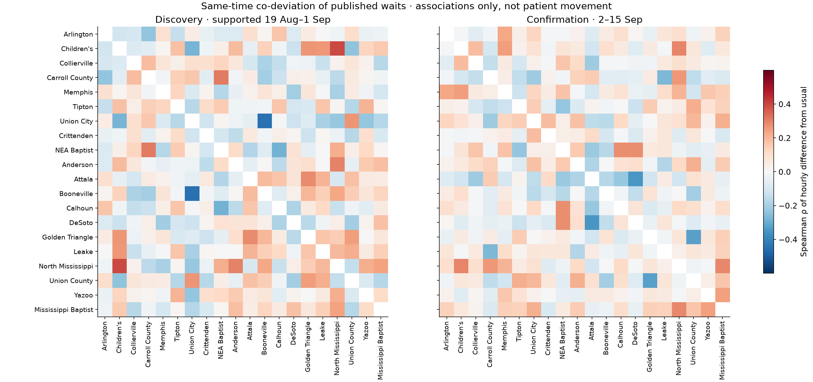
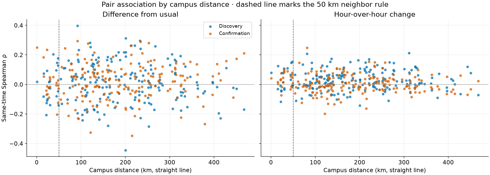

# M3 validation — relationships explorer

M3 is **in progress**. The first deliverable, a facility-by-time heatmap of
difference from usual with linked facility histories, is implemented. Neighbor
groups and a same-time/lagged relationship study are now run offline (below),
with a negative result. Geographic placement and replay are implemented and
validated locally (2026-09-26, not deployed). Held-out predictive checks remain
for the 2026-10-15 checkpoint. Nothing here claims patient movement or causal spillover.

## Heatmap — 2026-09-23 UTC

Implementation: [renderer and binning](../dashboard/heatmap.mjs), page section in
[index.qmd](../dashboard/index.qmd), wiring in [app.mjs](../dashboard/app.mjs),
styles in [latest.css](../dashboard/latest.css), tests in
[heatmap.test.mjs](../tests/heatmap.test.mjs).

Behavior:

- Rows are the 20 registry hospitals in registry order, labelled with the shared
  short names also used by the overview legend (`edwait.data.short_name`).
- Columns are clock-aligned UTC bins ending at the prepared history's cutoff:
  hourly for the seven-day view (168 columns) and 15-minute for the 24-hour view
  (96 columns). The shared time control drives both the overview and heatmap.
  Chicago offsets are whole hours, so bins align to local hours across DST.
- Each cell is the **median** of M1's per-reading difference from the past-only
  usual median (`comparisons.json` history column 5). No new artifact, schema or
  storage contract is introduced; the view reuses the build-time history.
- Seven discrete diverging steps: within ±10 minutes (M1's meaningful distance)
  is neutral gray; 10–20, 20–40 and 40+ minutes step toward blue (below usual)
  or red (above usual). Lightness rises symmetrically with magnitude on the dark
  surface (OKLab L 0.48/0.62/0.76 below, 0.50/0.62/0.79 above, 0.39 neutral).
- Periods without readings are blank. Periods with readings but no supported
  usual range are hatched, so missing and unsupported data stay distinct.
- Each cell has a tooltip with the full hospital name, Chicago time span, median
  difference and reading count. A disclosure holds a per-hospital summary table
  (periods observed, supported, 10+ above, 10+ below, largest above) and a
  limits note that aligned colors do not show patients moving between hospitals.
- Selecting a row by click, tap, Enter or Space focuses that hospital in the
  individual chart above and scrolls to it; the selected row label is highlighted.
- Axis labels fall on Chicago midnights (seven days) or 6-hour marks (24 hours),
  thinned to fit the width. The chart keeps a 560 px drawing minimum and scrolls
  horizontally inside its own region on narrow screens, like the focus chart.

Validation:

- Five JavaScript tests cover band thresholds, bin alignment and counts, medians
  over supported readings, unsupported and empty periods, ignored out-of-window
  readings, hospitals without history, HTML escaping, focus state, summary table,
  and midnight/6-hour labels across the 2026-11-01 DST change.
- A Python test now checks every browser module imported by `app.mjs` and
  `overview.mjs` is in Quarto's resource list; the first render omitted
  `heatmap.mjs` until it was added.
- Rendered with live read-only S3 history (20 facilities, 13,439 seven-day points,
  generated 07:05:46 UTC) and reviewed in Chrome at desktop width: 3,340 hourly
  cells over 20 rows; 1,900 cells in the 24-hour view; row click and Enter changed
  the focus selection; minimum text size 16 px; no console errors.
- 390 and 320 px same-origin frames: no page-width overflow, legend wraps, chart
  scrolls inside its region, 16 px minimum text, and no clipped row labels after
  widening the narrow label column to 168 px.

Limits: this is a descriptive exploration of published readings relative to each
hospital's own past. Shared weekday/hour effects are partly removed by the M1
reference but not modeled; collection gaps, reporting changes and zero readings
of unconfirmed meaning can align across rows. The M3 acceptance criteria
(episode inspection, calendar/serial-dependence checks, stability in later periods)
are not yet met.

## Relationship study — 2026-09-24 UTC

Protocol fixed before any pair statistic: [m3-relationship-protocol.md](m3-relationship-protocol.md).
Implementation: [relationships.py](../edwait/relationships.py), runner
[m3_relationships.py](../scripts/m3_relationships.py), tests
[test_relationships.py](../tests/test_relationships.py), aggregate output
[m3-relationship-results.json](m3-relationship-results.json). Input is M5's frozen
snapshot (SHA-256 `efda699f…88ed`, 107,257 records); M5's final holdout
(2026-09-16 onward) was not read. Runtime 34 s. Offline only: no artifact, schema,
S3 object or dashboard change.

Reproduce with `.venv/Scripts/python.exe scripts/m3_relationships.py .cache/m5-history-20260923.json`;
the script refuses any other snapshot.

### Neighbor groups (geography only)

Campus centers within 50 km form 21 neighbor pairs and three groups: Memphis
metro (Memphis, Children's, Collierville, Arlington, DeSoto, Crittenden, Tipton),
Attala–Leake, and Booneville–North Mississippi–Union County. The other eight
facilities have no campus within 50 km. Distance is straight-line between
unreviewed campus centers, not travel time.

### Results

All 190 pairs met support in both periods (1,520 tests each). Every facility had
331 supported hourly bins in discovery (14 days from 2026-08-19; see the
protocol's execution note) and 336 in confirmation.

| Family | Discovery BH q ≤ 0.10 | Robust with ρ ≥ 0.20 | Confirmed |
| --- | --- | --- | --- |
| Same-time co-deviation (190) | 0 | 0 | — |
| Same-time change (190) | 1 | 1 | 0 |
| Lagged change, 1–3 h both ways (1,140) | 0 | 0 | — |

The only candidate, Tipton–Leake same-time change (311 km apart; discovery
ρ = 0.21, bootstrap 95% 0.04–0.37), vanished in confirmation (ρ = −0.01,
−0.09–0.08) and is **not supported**. No pair is labeled confirmed, so no
episode lists are produced and no "rises together" or "preceded" language is
supported by this data.

Neighbors look no different from distant pairs:

| Same-time median ρ | Neighbor (21) | 50–150 km (61) | Over 150 km (108) |
| --- | --- | --- | --- |
| Co-deviation, discovery / confirmation | −0.02 / −0.01 | 0.04 / 0.03 | 0.00 / 0.03 |
| Hourly change, discovery / confirmation | 0.02 / 0.04 | 0.01 / −0.01 | 0.03 / 0.00 |

Memphis–Children's, 0.6 km apart, had co-deviation ρ = 0.02 then 0.25 and change
ρ = 0.08 then 0.04. The one confirmation-period co-deviation pair significant
on its own (Yazoo–Mississippi Baptist, ρ = 0.24, q = 0.04) was not a discovery
candidate and involves Yazoo's zero-heavy feed, so it is noted, not reported as a finding.

### Serial dependence and power

Hourly deviations are strongly persistent (lag-one autocorrelation 0.34–0.97;
median effective sample about 84 of 331 bins for co-deviation). Without the
correction, 85 of 190 discovery co-deviation pairs would have looked significant
at p < 0.05; with it, 12, close to the ~10 expected by chance. Changes are much
less persistent (effective sample about 314), and there too only 20 of 190 had
p < 0.05 before multiple-testing correction.

The co-deviation screen is weak: at an effective sample near 84, a single test
needs |ρ| ≈ 0.21 for p < 0.05, and surviving BH across 190 tests needs roughly
|ρ| ≥ 0.37. Moderate shared elevation could therefore go undetected. The change
screens detect |ρ| ≈ 0.11 nominally and about 0.2 after correction, so hour-to-hour
co-movement larger than that among these facilities is unlikely in this window.

### Interpretation and limits

- Over these four weeks, departures from usual at Baptist facilities, including
  close Memphis-metro neighbors, did not measurably move together, at the same
  time or with one- to three-hour lags, beyond what chance and each hospital's
  own persistence explain. This is a validated negative result, not proof of
  independence: the window is short, the metric's meaning is unconfirmed, and
  hourly medians can hide sub-hour or multi-day effects.
- Arlington (19–20%), Crittenden (14–16%) and Yazoo (29–34%) exceed 10% zero
  readings; their pairs would be labeled exploratory regardless of score.
  Collierville (9–10%) and Anderson (8–9%) are close to that limit.
- Wait histories cannot show patient transfers, diversion or capacity. A later
  positive result would still be an association of published readings.

Acceptance status: the explorer does not yet support episode inspection beyond
the heatmap; calendar, serial-dependence and later-period checks are implemented
and found no stable relationship. M3 remains in progress.

## Map and replay — 2026-09-26 UTC

Implemented and validated locally; **not deployed**. The Versus usual section gains
a map and a replay bar under the heatmap. Files: [geo.mjs](../dashboard/geo.mjs)
(states, snapshot, replay controls), [geo-map.mjs](../dashboard/geo-map.mjs)
(MapLibre markers), the replay outline in [heatmap.mjs](../dashboard/heatmap.mjs),
wiring in [app.mjs](../dashboard/app.mjs), markup and disclosure in
[index.qmd](../dashboard/index.qmd), styles in [latest.css](../dashboard/latest.css).

- Each hospital sits at its OpenStreetMap campus center, now embedded in the page's
  registry JSON. No new artifact or storage contract: colors come from the same
  binned `comparisons.json` history as the heatmap (hourly over seven days,
  15-minute over 24 hours), in the heatmap's seven diverging steps.
- Markers are buttons with glyphs (▲ 10+ above usual, ▼ 10+ below, ● within 10,
  ? no usual range, – no reading), an accessible label naming the hospital, state
  and period, and the focused hospital ringed. Activating one focuses that hospital.
- Replay: a slider over the window's periods, Play/Pause (one period per 0.7 s,
  stopping at the latest), and Latest. The selected period is outlined in the
  heatmap, which moves in place without re-rendering. The slider's
  `aria-valuetext` carries the period, so playback does not flood a live region.
  A rebuild keeps the chosen period while it remains in the window; switching
  between 24 hours and 7 days returns to the latest period.
- View: the page's existing area groups (all hospitals, three states, and M3's
  50 km neighbor groups) frame the map, separating the Memphis area's seven
  campuses. The map refits on resize until the user pans or zooms.
- Map code and tiles load only when the section nears the viewport. Viewing loads
  the map area from OpenFreeMap, as the origin map does; the disclosure says so.
  If the map fails, a status line points to the heatmap, which shows the same values.

Validation: 7 new tests in [geo.test.mjs](../tests/geo.test.mjs) (states and
glyphs, snapshot equals the heatmap column and skips hospitals without a campus,
period persistence, the heatmap outline, stepping/play/latest/window reset, views,
map failure). Suites: 90 Python and 67 JavaScript tests passed; Quarto rendered.
The desktop app's browser pane was hidden, so it could not draw; headless Chrome
(temporary profile, local review server with read-only S3 history) was used
instead. At 1264 px: 20 markers on the basemap; stepping the slider from period
167 to 161 changed every marker and moved the heatmap outline; activating a marker
focused Mississippi Baptist; the Memphis-area view separated the cluster (Baptist
Memphis and Children's, about 0.5 km apart, still touch until zoomed). No element
extended past the section. Fresh loads at 390 and 320 px framed all 20 hospitals
with no page overflow; the smallest text was 16 px throughout. The only console
message was the shared map style's missing `circle-11` POI icon, present since
the origin map's release.

Limits: the same as the heatmap, plus map placement by campus center; nearness is
not a service area and shared colors are not evidence of patient movement. The
acceptance criterion on inspecting the episodes behind an association has nothing
to inspect yet, because no association was confirmed; replay and the linked focus
chart let any period be inspected.
