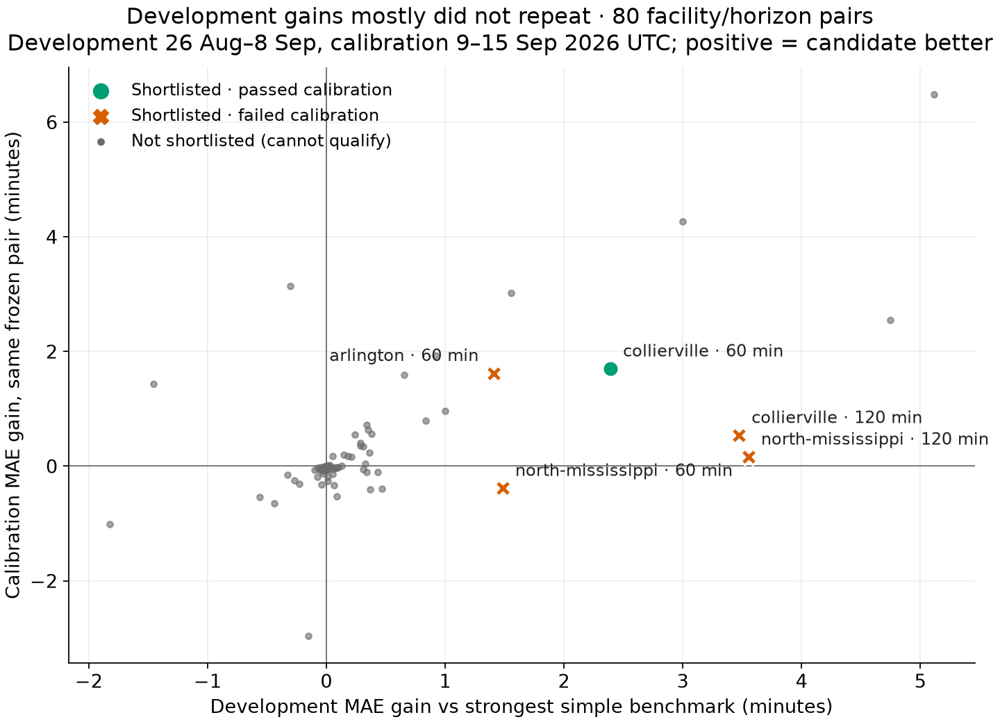
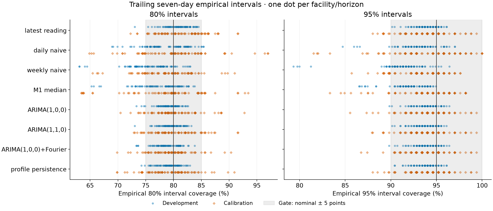
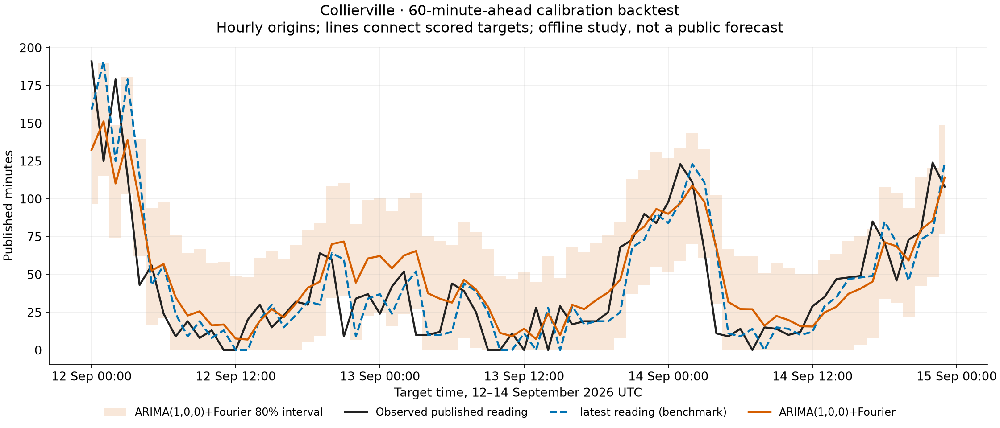

# M5 candidate study (v2) — development and calibration, 2026-09-24 UTC

Status: offline only. Development and calibration scored with a frozen specification; the final holdout remains **unscored**. No public forecast, artifact or schema exists.

This continues the [benchmark checkpoint](m5-validation.md) and [ARIMA pilot](m5-arima-validation.md) on the same frozen snapshot (`efda699fb411…`). The [protocol amendment](m5-study-protocol.md#amendment--2026-09-24-utc-before-calibration-scoring) records every choice made here, and the [freeze record](m5-freeze.json) fixes the specification hash `b7fb1eedfc47…`, each facility/horizon pair and the shortlist, frozen at 2026-09-24T01:13:09+00:00 before calibration was scored.

```powershell
.venv\Scripts\python.exe scripts/m5_diagnostics.py .cache/m5-history-20260923.json
.venv\Scripts\python.exe scripts/m5_candidates.py .cache/m5-history-20260923.json --phase development
.venv\Scripts\python.exe scripts/m5_candidates.py .cache/m5-history-20260923.json --phase development --delay-slots 1
.venv\Scripts\python.exe scripts/m5_freeze.py
.venv\Scripts\python.exe scripts/m5_candidates.py .cache/m5-history-20260923.json --phase calibration
.venv\Scripts\python.exe scripts/m5_candidates_report.py
```

The runner refuses calibration or holdout unless the freeze matches the specification and code hashes, and refuses the holdout without a scored calibration and `--confirm-holdout`.

## Diagnostics (data before 9 September only)

Local hour of day explains 1%–35% of each hospital's reading variance (13 of 20 at or below about 10%; Memphis highest). One-day-lag autocorrelation is 0.02–0.52 and one-week-lag −0.01–0.40, and weekly medians move substantially (DeSoto 26→90 minutes). Readings are highly persistent over 15–30 minutes. A 96-slot seasonal ARIMA is therefore not justified; two bounded calendar candidates were added instead. Per-facility values are in the [aggregate results](m5-candidates-results.json).

## Development (26 August–8 September UTC)

Cold start is fixed: 1120/1120 daily fits succeeded with no support abstentions or failures (v1: 40 abstentions, 92.8% availability). Where training windows are identical, v2 reproduces all 61,200 v1 ARIMA and benchmark forecasts exactly. The largest per-day sum of fit times for all 20 facilities and four candidates was 12 s (including one-time library import), against the 600 s limit.

Best candidate per pair: ARIMA(1,1,0) 44, profile persistence 15, ARIMA(1,0,0)+Fourier 15, ARIMA(1,0,0) 6. Strongest simple benchmark: latest reading 70, M1 median 10.

5/80 pairs passed every gate on development and form the shortlist: arlington 60 min, collierville 60 min, collierville 120 min, north-mississippi 60 min, north-mississippi 120 min. Most failures were the minimum gain (72/80) and bootstrap interval (61/80). These passes are selection-biased: each pair's best candidate was chosen on the same data.

With a one-slot (15-minute) availability delay, 5/80 pairs passed, collierville 60 min, collierville 120 min, memphis 120 min, north-mississippi 60 min, north-mississippi 120 min. Benchmark rankings were nearly unchanged.

Intervals built from each model's trailing seven-day errors were close to nominal on development: latest reading 79/80 (80%) and 80/80 (95%) within 5 points; ARIMA(1,1,0) 79/80 (80%) and 80/80 (95%) within 5 points; ARIMA(1,0,0)+Fourier 76/80 (80%) and 79/80 (95%) within 5 points; profile persistence 78/80 (80%) and 80/80 (95%) within 5 points.

## Calibration (9–15 September UTC, frozen pairs)

Candidates lowered MAE in 32/80 pairs. 5/80 passed every gate, but only 1 of those was shortlisted: collierville 60 min. Under the frozen rule only shortlisted pairs can qualify.

| Shortlisted pair | Frozen benchmark → candidate | Development gain | Calibration gain (95% block bootstrap) | 80% / 95% coverage | Calibration |
| --- | --- | --- | --- | --- | --- |
| arlington 60 min | M1 median → profile persistence | +1.41 | +1.62 (+0.08 to +2.99) | 85% / 95% | Fail: coverage |
| collierville 60 min | latest reading → ARIMA(1,0,0)+Fourier | +2.39 | +1.70 (+0.18 to +3.50) | 79% / 96% | Pass |
| collierville 120 min | M1 median → profile persistence | +3.48 | +0.54 (-2.26 to +3.25) | 81% / 95% | Fail: gain, bootstrap |
| north-mississippi 60 min | latest reading → ARIMA(1,0,0)+Fourier | +1.49 | -0.39 (-1.88 to +1.27) | 79% / 94% | Fail: gain, bootstrap |
| north-mississippi 120 min | latest reading → ARIMA(1,0,0)+Fourier | +3.56 | +0.16 (-3.23 to +3.88) | 78% / 93% | Fail: gain, bootstrap |

Gains are minutes of MAE reduction versus the frozen benchmark; positive favors the candidate.

Not shortlisted but passing on calibration: anderson 60 min (profile persistence, +3.0), anderson 120 min (profile persistence, +1.6), baptist-medical-center 60 min (profile persistence, +4.3), memphis 120 min (profile persistence, +6.5). They cannot qualify in this study. Together with the development results, they suggest profile persistence may help at 60–120 minutes for the most variable hospitals. Testing that needs a new pre-registered study on data collected after 23 September.

Calibration interval coverage stayed near nominal (ARIMA(1,0,0)+Fourier 66/80 and 77/80; profile persistence 63/80 and 75/80 within 5 points), but 18 selected candidates missed the coverage gate at one or both levels. Maximum daily fit time was 13 s.







## Status and limits

Holdout-eligible: collierville 60 min. The final holdout (16–22 September UTC) is unscored. Scoring it is a one-time action; if this pair passes there, including the delayed-availability gain check, it becomes the only forecast eligible for display. Display would still require the plan's forecast artifact contract, chart validation and a deployed smoke check. A negative holdout result ends this study with forecasts disabled.

Hourly origins give at most 168 targets per phase, and seven daily blocks make bootstrap intervals coarse. Overlapping multi-step errors are dependent. `observed_at` stands in for availability. Forecasts describe the published reading, not an individual patient's wait.
