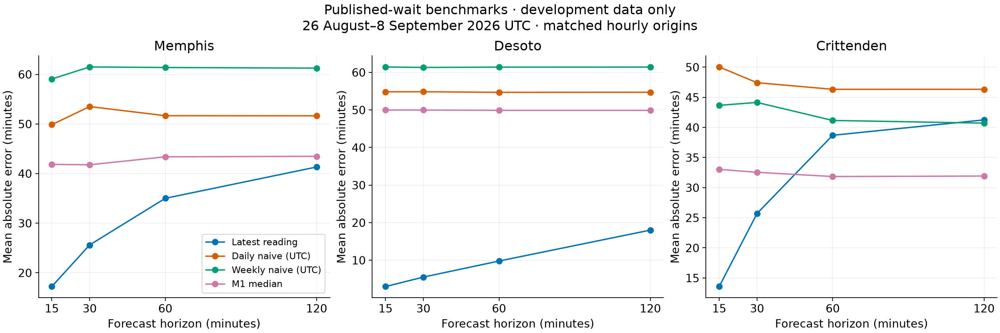
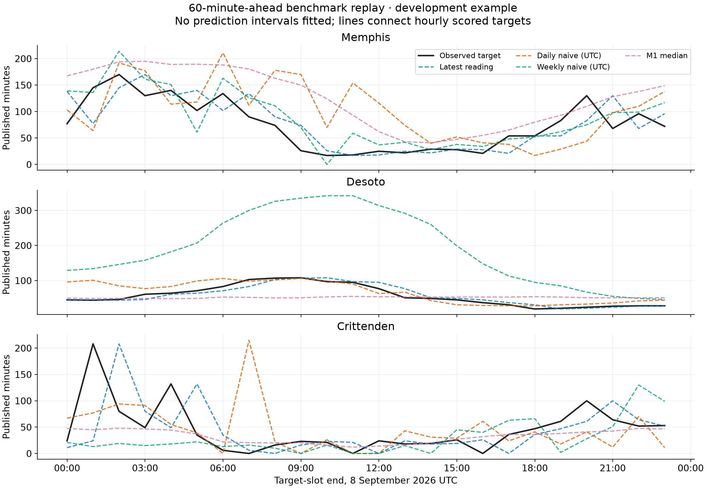

# M5 benchmark checkpoint — 2026-09-23 UTC

Status: implemented and locally validated offline; M5 remains in progress. No public forecasts.

## Inputs and reproducibility

Frozen snapshot: 107,257 observations across 56 UTC partitions, 29 July through 22 September 2026. M0 selected one partition source; no raw/compacted concatenation.

SHA-256: `efda699fb411e72c49374024e847834bfd225f580789d6140034e235234588ed`. Rejections: 0; logical duplicates: 0; grid collisions resolved: 20; negative records excluded: 0.

[Frozen protocol](m5-study-protocol.md) defines slot/availability rules, chronological phases, benchmarks, and provisional model-release gates. [Manifest](m5-study-manifest.json) records source, dependencies and hashes. Detailed inputs and origin-level results are local ignored artifacts; the snapshot hash identifies the exact input.

```powershell
.venv\Scripts\python.exe scripts/m1_snapshot.py --start 2026-07-29T00:00:00Z --end 2026-09-23T00:00:00Z --output .cache/m5-history-20260923.json
.venv\Scripts\python.exe scripts/m5_benchmarks.py .cache/m5-history-20260923.json --freeze-only
.venv\Scripts\python.exe scripts/m5_benchmarks.py .cache/m5-history-20260923.json
.venv\Scripts\python.exe scripts/m5_benchmarks.py .cache/m5-history-20260923.json --delay-slots 1
.venv\Scripts\python.exe scripts/m5_report.py
```

A fresh S3 read may have a different hash if late data arrives; preserve the frozen snapshot to reproduce these exact scores. Install `requirements-analysis.txt` separately; deployment does not install modeling/plotting packages.

## Development results

Scored 26,820 facility/origin/horizon rows for 26 August–8 September UTC. Lowest matched-origin MAE: carry-forward 70/80; M1 median 10/80. Neither seasonal-naive benchmark led a combination. Ties prefer the simpler model. These are development rankings, not evidence of final-test forecast skill.

The 15-minute availability-delay sensitivity produced carry-forward 69/80 and M1 median 11/80 winners. Runtime was 28.0s and 27.4s respectively on this workstation.



Table cells show the winning baseline and its MAE in minutes. CF = latest reading; M1 = local-time median.

| Facility | 15 min | 30 min | 60 min | 120 min |
| --- | --- | --- | --- | --- |
| anderson | CF · 10.77 | CF · 21.66 | M1 · 31.21 | M1 · 31.09 |
| arlington | CF · 5.52 | CF · 9.93 | M1 · 15.00 | M1 · 14.96 |
| baptist-medical-center | CF · 13.71 | CF · 23.40 | CF · 36.11 | M1 · 40.66 |
| baptist-medical-center-attala | CF · 1.35 | CF · 3.32 | CF · 6.57 | CF · 11.05 |
| baptist-medical-center-leake | CF · 1.26 | CF · 2.40 | CF · 3.88 | CF · 6.62 |
| baptist-medical-center-yazoo | CF · 4.80 | CF · 8.49 | M1 · 13.04 | M1 · 13.07 |
| booneville | CF · 0.84 | CF · 1.45 | CF · 2.28 | CF · 3.88 |
| calhoun | CF · 0.57 | CF · 1.82 | CF · 2.77 | CF · 4.58 |
| childrens | CF · 2.50 | CF · 4.22 | CF · 7.32 | CF · 13.35 |
| collierville | CF · 12.65 | CF · 19.88 | CF · 27.33 | M1 · 34.00 |
| crittenden | CF · 13.57 | CF · 25.71 | M1 · 31.84 | M1 · 31.93 |
| desoto | CF · 2.99 | CF · 5.51 | CF · 9.78 | CF · 18.01 |
| golden-triangle | CF · 1.40 | CF · 2.81 | CF · 4.99 | CF · 9.18 |
| huntingdon | CF · 2.22 | CF · 3.97 | CF · 7.20 | CF · 12.46 |
| memphis | CF · 17.22 | CF · 25.61 | CF · 35.01 | CF · 41.33 |
| nea | CF · 1.01 | CF · 1.60 | CF · 2.68 | CF · 4.57 |
| north-mississippi | CF · 2.12 | CF · 3.77 | CF · 7.49 | CF · 14.40 |
| tipton | CF · 2.39 | CF · 3.75 | CF · 5.77 | CF · 10.01 |
| union-city | CF · 1.24 | CF · 2.29 | CF · 4.13 | CF · 6.80 |
| union-county | CF · 1.10 | CF · 2.01 | CF · 3.52 | CF · 6.02 |

[All aggregate metrics](m5-benchmark-results.json) include each model's own and matched-origin MAE, RMSE, bias, support/abstention counts, zero-target errors, and past-threshold spike errors. Do not treat the matched subset as the entire feed or the many overlapping forecast errors as independent.



## Validation and remaining work

Focused tests cover future-data mutation across local midnight, exact UTC slot boundaries, deterministic collisions, metric separation, zero/negative/missing values, delayed availability, DST repeated hours and error denominators. No future filling, synthetic validation targets or random split is used.

This checkpoint evaluates simple benchmarks. A subsequent [ARIMA development pilot](m5-arima-validation.md) evaluates two nonseasonal candidates; seasonal diagnostics, interval calibration and final holdout scoring remain pending. The snapshot contains the later periods, but the evaluation only scores development. Ingestion/publication timestamps are unavailable: `observed_at` and a one-slot delay are sensitivity assumptions. Per-facility/horizon release decisions remain **disabled** until the full protocol passes. No forecast record/storage contract or production deployment changed.
